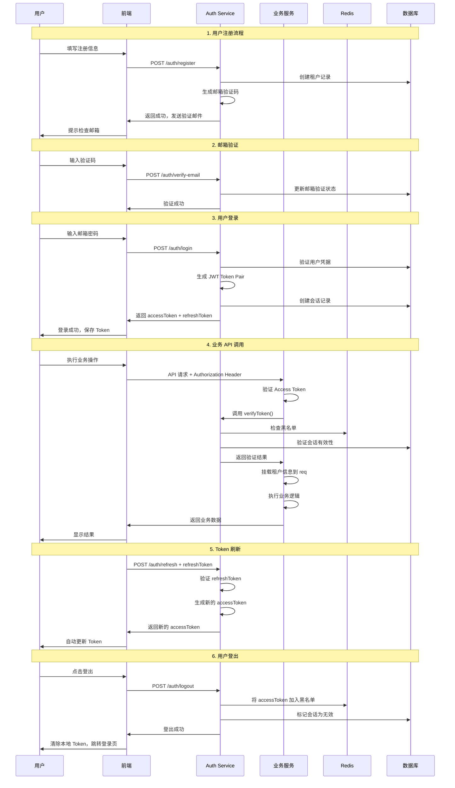

# Auth Service - 认证微服务

## 概述
Auth Service 是 **tymoe 平台统一身份中心**，负责用户注册、登录、JWT 签发与验证、租户管理和会话控制。  
它保证所有下游业务服务（如 Beauty / FnB）能够在统一的身份体系下运行。

- **身份认证**：注册、登录、邮箱验证、密码重置  
- **JWT 管理**：Access/Refresh Tokens 签发与验证  
- **会话管理**：支持单会话或所有会话失效  
- **租户管理**：多租户隔离与租户信息管理  
- **安全机制**：黑名单、速率限制、密码强度校验、CORS、安全头

> ⚠️ 注意：订阅/套餐逻辑由 **Subscription Service** 管理，Auth Service 仅负责身份认证。

---

## 技术栈
- Node.js + TypeScript
- Express.js
- PostgreSQL + Prisma ORM
- Redis（Token 黑名单与会话存储）
- JWT（HS256 签名）
- bcrypt（密码哈希）
- Joi（参数校验）
- Winston（日志）
- Helmet, CORS, Rate Limiting（安全）

---

## JWT 签发与验证逻辑

### Token 类型
- **Access Token**
  - 短期有效（默认 15 分钟）
  - 用于业务服务 API 调用
- **Refresh Token**
  - 长期有效（默认 7 天）
  - 仅用于换取新的 Access Token
- **Email Verification / Password Reset Tokens**
  - 一次性或短期凭证，用于验证邮箱和重置密码

### 签发流程
1. 用户注册或登录成功后，调用 `generateTokenPair()`。
2. 生成 **Access Token + Refresh Token**。
   - Access Token 使用 `JWT_SECRET`  
   - Refresh Token 使用 `JWT_REFRESH_SECRET`
3. 两者 Payload 含相同用户信息，区别在于过期时间和用途。

### JWT Payload 示例
```json
{
  "tenantId": "uuid-tenant-123",
  "email": "user@example.com",
  "storeName": "Test Store",
  "subdomain": "teststore",
  "emailVerified": true,
  "sessionId": "uuid-session-456",
  "type": "access",             // access | refresh | email_verification | password_reset
  "iss": "tymoe",
  "aud": "tymoe_tenant",
  "jti": "random-uuid",
  "iat": 1700000000,
  "exp": 1700000900
}
```

### 验证流程
1. 下游服务从请求头读取 `Authorization: Bearer <token>`。
2. 使用共享的 `verifyToken(token, type)` 验证：
   - 校验签名（Access 用 JWT_SECRET，Refresh 用 JWT_REFRESH_SECRET）
   - 校验标准声明：iss="tymoe"，aud="tymoe_tenant"
   - 校验 type 是否匹配
   - 校验 Token 是否在黑名单（Redis）
   - 校验会话是否有效（sessionId 未过期/未吊销）
3. 验证通过后，将 payload 挂载到请求上下文：
   - `req.tenantId`
   - `req.userEmail`
   - `req.sessionId`
   - `req.emailVerified`

---

## 认证流程时序图



---

## 已实现的接口

### 认证相关
- `POST /api/v1/auth/register`              # 用户注册
- `POST /api/v1/auth/login`                 # 用户登录
- `POST /api/v1/auth/logout`                # 用户登出
- `POST /api/v1/auth/refresh`               # 使用 refreshToken 换取新的 accessToken
- `POST /api/v1/auth/verify-email`          # 邮箱验证
- `POST /api/v1/auth/resend-verification`   # 重新发送验证邮件
- `POST /api/v1/auth/initiate-reset`        # 发起密码重置
- `POST /api/v1/auth/verify-reset-code`     # 验证重置码
- `POST /api/v1/auth/reset-password`        # 重置密码
- `PUT  /api/v1/auth/password`              # 修改密码

### 租户管理
- `GET    /api/v1/tenant/:tenantId`         # 获取租户信息
- `PUT    /api/v1/tenant/:tenantId`         # 更新租户信息
- `GET    /api/v1/tenant/check-unique`      # 检查字段唯一性
- `GET    /api/v1/tenant/by-email`          # 根据邮箱查询租户
- `DELETE /api/v1/tenant/:tenantId`         # 删除租户

### 会话管理
- `POST /api/v1/session/invalidate`         # 失效当前会话
- `POST /api/v1/session/invalidate-all`     # 失效所有会话

---

## 与前端协作

### Token 管理流程
1. 登录后保存 `accessToken` 和 `refreshToken`。
2. 请求 API 时自动附带 `Authorization: Bearer <accessToken>`。
3. Access Token 过期 → 前端用 `refreshToken` 调 `/auth/refresh` 获取新 Access Token。
4. Refresh Token 过期 → 用户需重新登录。

### 前端错误处理
- `401` → Token 过期或无效
- `403` → 权限不足/邮箱未验证
- `402` → 订阅服务未开通（由 Subscription Service 返回）

---

## 与其他微服务协作

### Token 验证中间件
其他服务引入共享的 `verifyToken()` 方法，在路由前校验 Access Token 并挂载租户信息。

### 数据隔离
所有业务表必须有 `tenant_id` 字段，查询/更新时带上 `tenantId`，确保多租户隔离。

---

## 部署与运维

### 启动服务
```bash
npm install
npm run prisma:generate
npm run prisma:migrate
npm run dev  # 开发模式
npm start    # 生产模式
```

### 健康检查
```bash
curl http://localhost:3002/health
```

### 安全注意事项
1. 生产环境必须更换 JWT 密钥
2. 强制使用 HTTPS
3. 开启速率限制，防止暴力破解
4. 定期清理黑名单与过期会话

---

## 总结
- **Auth Service = 身份源**
- 只负责"认证 + JWT 签发验证"
- **Access Token = 短期访问凭证**
- **Refresh Token = 长期会话凭证**
- **业务服务 = 校验 Access Token + 调 Subscription Service 判断权限**

这样设计保证了：
- 身份认证与订阅逻辑分离
- 微服务间数据隔离清晰
- 系统具备可扩展性和高安全性 