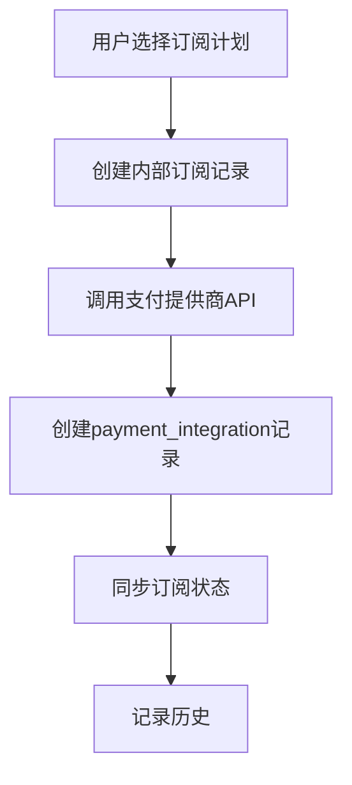
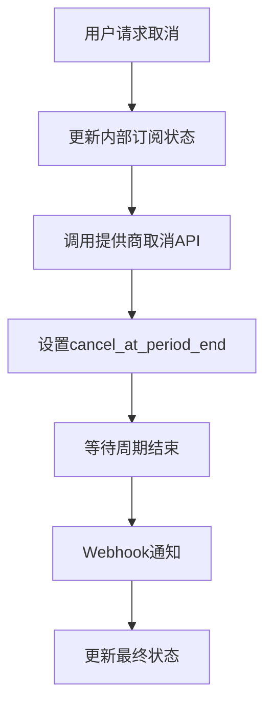
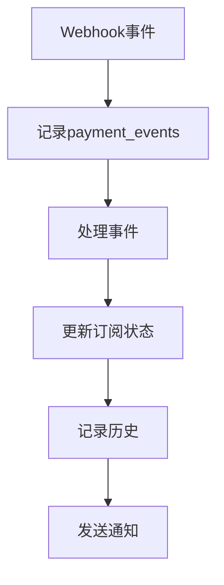

# 多支付提供商订阅管理数据库设计

## 设计目标

设计一个灵活的数据库架构，支持多种支付提供商（Stripe、PayPal、Square、Clover等），同时保持系统的可扩展性和维护性。

## 核心设计原则

### 1. 支付提供商抽象化
- 使用通用字段表示所有支付提供商的共同属性
- 支付提供商特定数据存储在JSON字段中
- 支持未来新增支付提供商

### 2. 订阅状态统一管理
- 内部订阅状态与外部支付提供商状态分离
- 提供状态映射机制
- 支持复杂的业务逻辑

### 3. 数据一致性保障
- 事件驱动的状态同步
- 审计日志完整记录
- 幂等性处理

## 数据库表设计

### 1. 核心租户表 (tenants)

```sql
CREATE TABLE tenants (
  -- 基础信息
  id                    UUID PRIMARY KEY DEFAULT gen_random_uuid(),
  email                 VARCHAR(255) UNIQUE NOT NULL,
  password_hash         VARCHAR(255) NOT NULL,
  store_name            VARCHAR(100) NOT NULL,
  subdomain             VARCHAR(50) UNIQUE NOT NULL,
  phone                 VARCHAR(20) UNIQUE NOT NULL,
  address               VARCHAR(500),
  
  -- 系统字段
  email_verified_at     TIMESTAMP,
  password_reset_token  VARCHAR(255),
  password_reset_expires_at TIMESTAMP,
  email_verification_token VARCHAR(255),
  
  -- 时间戳
  created_at            TIMESTAMP DEFAULT NOW(),
  updated_at            TIMESTAMP DEFAULT NOW()
);
```

**设计说明：**
- 移除所有支付和订阅相关字段
- 保持租户表的纯净性
- 支付和订阅信息通过关联表管理

### 2. 订阅管理表 (subscriptions)

```sql
CREATE TABLE subscriptions (
  -- 基础信息
  id                    UUID PRIMARY KEY DEFAULT gen_random_uuid(),
  tenant_id             UUID NOT NULL REFERENCES tenants(id) ON DELETE CASCADE,
  
  -- 订阅状态 (内部业务状态)
  status                VARCHAR(20) NOT NULL DEFAULT 'trial',
  plan                  VARCHAR(20) NOT NULL DEFAULT 'basic',
  
  -- 订阅周期
  billing_cycle         VARCHAR(20) NOT NULL DEFAULT 'monthly', -- monthly/yearly
  current_period_start  TIMESTAMP,
  current_period_end    TIMESTAMP,
  trial_ends_at         TIMESTAMP,
  
  -- 取消管理
  cancel_at_period_end  BOOLEAN DEFAULT FALSE,
  canceled_at           TIMESTAMP,
  cancellation_reason   VARCHAR(255),
  
  -- 定价信息
  currency              VARCHAR(3) DEFAULT 'CAD',
  amount_cents          INTEGER, -- 金额（分）
  
  -- 时间戳
  created_at            TIMESTAMP DEFAULT NOW(),
  updated_at            TIMESTAMP DEFAULT NOW(),
  
  -- 索引
  INDEX idx_tenant_id (tenant_id),
  INDEX idx_status (status),
  INDEX idx_current_period_end (current_period_end),
  INDEX idx_cancel_at_period_end (cancel_at_period_end),
  INDEX idx_trial_ends_at (trial_ends_at)
);
```

**设计说明：**
- 内部订阅状态管理，不依赖外部支付提供商
- 支持多种计费周期和货币
- 完整的取消策略支持

### 3. 支付提供商集成表 (payment_integrations)

```sql
CREATE TABLE payment_integrations (
  -- 基础信息
  id                    UUID PRIMARY KEY DEFAULT gen_random_uuid(),
  tenant_id             UUID NOT NULL REFERENCES tenants(id) ON DELETE CASCADE,
  subscription_id       UUID NOT NULL REFERENCES subscriptions(id) ON DELETE CASCADE,
  
  -- 支付提供商信息
  provider              VARCHAR(20) NOT NULL, -- stripe/paypal/square/clover
  provider_customer_id  VARCHAR(255) NOT NULL,
  provider_subscription_id VARCHAR(255),
  
  -- 提供商特定数据 (JSON存储)
  provider_data         JSONB,
  
  -- 状态映射
  provider_status       VARCHAR(50), -- 提供商原始状态
  last_sync_at          TIMESTAMP,
  sync_error            TEXT,
  
  -- 配置信息
  is_active             BOOLEAN DEFAULT TRUE,
  webhook_endpoint      VARCHAR(255),
  
  -- 时间戳
  created_at            TIMESTAMP DEFAULT NOW(),
  updated_at            TIMESTAMP DEFAULT NOW(),
  
  -- 约束和索引
  UNIQUE(provider, provider_customer_id),
  UNIQUE(provider, provider_subscription_id),
  INDEX idx_tenant_id (tenant_id),
  INDEX idx_subscription_id (subscription_id),
  INDEX idx_provider (provider),
  INDEX idx_provider_customer_id (provider_customer_id),
  INDEX idx_provider_subscription_id (provider_subscription_id),
  INDEX idx_is_active (is_active)
);
```

**设计说明：**
- 支持多个支付提供商同时集成
- 提供商特定数据存储在JSONB字段中
- 状态映射机制处理不同提供商的状态差异

### 4. 支付方式表 (payment_methods)

```sql
CREATE TABLE payment_methods (
  -- 基础信息
  id                    UUID PRIMARY KEY DEFAULT gen_random_uuid(),
  tenant_id             UUID NOT NULL REFERENCES tenants(id) ON DELETE CASCADE,
  
  -- 支付方式信息
  provider              VARCHAR(20) NOT NULL,
  provider_payment_method_id VARCHAR(255) NOT NULL,
  
  -- 支付方式类型和信息
  type                  VARCHAR(20) NOT NULL, -- card/bank_account/wallet
  brand                 VARCHAR(20), -- visa/mastercard/amex
  last4                 VARCHAR(4),
  exp_month             INTEGER,
  exp_year              INTEGER,
  
  -- 状态管理
  is_default            BOOLEAN DEFAULT FALSE,
  is_active             BOOLEAN DEFAULT TRUE,
  
  -- 提供商特定数据
  provider_data         JSONB,
  
  -- 时间戳
  created_at            TIMESTAMP DEFAULT NOW(),
  updated_at            TIMESTAMP DEFAULT NOW(),
  
  -- 约束和索引
  UNIQUE(provider, provider_payment_method_id),
  INDEX idx_tenant_id (tenant_id),
  INDEX idx_provider (provider),
  INDEX idx_is_default (is_default),
  INDEX idx_is_active (is_active)
);
```

### 5. 支付事件表 (payment_events)

```sql
CREATE TABLE payment_events (
  -- 基础信息
  id                    UUID PRIMARY KEY DEFAULT gen_random_uuid(),
  tenant_id             UUID REFERENCES tenants(id) ON DELETE CASCADE,
  subscription_id       UUID REFERENCES subscriptions(id) ON DELETE CASCADE,
  payment_integration_id UUID REFERENCES payment_integrations(id) ON DELETE CASCADE,
  
  -- 事件信息
  provider              VARCHAR(20) NOT NULL,
  provider_event_id     VARCHAR(255) NOT NULL,
  event_type            VARCHAR(100) NOT NULL,
  
  -- 处理状态
  processed             BOOLEAN DEFAULT FALSE,
  processed_at          TIMESTAMP,
  retry_count           INTEGER DEFAULT 0,
  max_retries           INTEGER DEFAULT 3,
  
  -- 事件数据
  event_data            JSONB,
  error_message         TEXT,
  
  -- 时间戳
  created_at            TIMESTAMP DEFAULT NOW(),
  updated_at            TIMESTAMP DEFAULT NOW(),
  
  -- 约束和索引
  UNIQUE(provider, provider_event_id),
  INDEX idx_tenant_id (tenant_id),
  INDEX idx_subscription_id (subscription_id),
  INDEX idx_provider (provider),
  INDEX idx_event_type (event_type),
  INDEX idx_processed (processed),
  INDEX idx_retry_count (retry_count),
  INDEX idx_created_at (created_at)
);
```

### 6. 订阅历史表 (subscription_history)

```sql
CREATE TABLE subscription_history (
  -- 基础信息
  id                    UUID PRIMARY KEY DEFAULT gen_random_uuid(),
  tenant_id             UUID NOT NULL REFERENCES tenants(id) ON DELETE CASCADE,
  subscription_id       UUID NOT NULL REFERENCES subscriptions(id) ON DELETE CASCADE,
  
  -- 变更信息
  action                VARCHAR(50) NOT NULL, -- created/updated/canceled/renewed/suspended
  
  -- 状态变更
  old_status            VARCHAR(20),
  new_status            VARCHAR(20),
  old_plan              VARCHAR(20),
  new_plan              VARCHAR(20),
  
  -- 关联事件
  payment_event_id      UUID REFERENCES payment_events(id),
  
  -- 变更详情
  changes               JSONB, -- 详细的变更内容
  reason                VARCHAR(255),
  
  -- 时间戳
  created_at            TIMESTAMP DEFAULT NOW(),
  
  -- 索引
  INDEX idx_tenant_id (tenant_id),
  INDEX idx_subscription_id (subscription_id),
  INDEX idx_action (action),
  INDEX idx_created_at (created_at)
);
```

### 7. 发票表 (invoices)

```sql
CREATE TABLE invoices (
  -- 基础信息
  id                    UUID PRIMARY KEY DEFAULT gen_random_uuid(),
  tenant_id             UUID NOT NULL REFERENCES tenants(id) ON DELETE CASCADE,
  subscription_id       UUID NOT NULL REFERENCES subscriptions(id) ON DELETE CASCADE,
  payment_integration_id UUID REFERENCES payment_integrations(id) ON DELETE SET NULL,
  
  -- 发票信息
  provider              VARCHAR(20),
  provider_invoice_id   VARCHAR(255),
  invoice_number        VARCHAR(100),
  
  -- 金额信息
  currency              VARCHAR(3) DEFAULT 'USD',
  subtotal_cents        INTEGER NOT NULL,
  tax_cents             INTEGER DEFAULT 0,
  total_cents           INTEGER NOT NULL,
  
  -- 状态管理
  status                VARCHAR(20) NOT NULL, -- draft/open/paid/void/uncollectible
  
  -- 时间信息
  period_start          TIMESTAMP,
  period_end            TIMESTAMP,
  due_date              TIMESTAMP,
  paid_at               TIMESTAMP,
  
  -- 发票数据
  invoice_data          JSONB,
  
  -- 时间戳
  created_at            TIMESTAMP DEFAULT NOW(),
  updated_at            TIMESTAMP DEFAULT NOW(),
  
  -- 约束和索引
  UNIQUE(provider, provider_invoice_id),
  INDEX idx_tenant_id (tenant_id),
  INDEX idx_subscription_id (subscription_id),
  INDEX idx_status (status),
  INDEX idx_due_date (due_date),
  INDEX idx_created_at (created_at)
);
```

### 8. 会话表 (sessions) - 保持不变

```sql
CREATE TABLE sessions (
  id                    UUID PRIMARY KEY DEFAULT gen_random_uuid(),
  tenant_id             UUID NOT NULL REFERENCES tenants(id) ON DELETE CASCADE,
  token_hash            VARCHAR(255) UNIQUE NOT NULL,
  refresh_token         VARCHAR(255) UNIQUE,
  user_agent            TEXT,
  ip_address            VARCHAR(45),
  expires_at            TIMESTAMP NOT NULL,
  deleted_at            TIMESTAMP,
  created_at            TIMESTAMP DEFAULT NOW(),
  updated_at            TIMESTAMP DEFAULT NOW(),
  
  INDEX idx_tenant_id (tenant_id),
  INDEX idx_token_hash (token_hash),
  INDEX idx_expires_at (expires_at),
  INDEX idx_created_at (created_at),
  INDEX idx_deleted_at (deleted_at)
);
```

### 9. Token黑名单表 (token_blacklist) - 保持不变

```sql
CREATE TABLE token_blacklist (
  id                    VARCHAR(25) PRIMARY KEY,
  jti                   VARCHAR(255) UNIQUE NOT NULL,
  tenant_id             UUID,
  expires_at            TIMESTAMP NOT NULL,
  reason                VARCHAR(255) DEFAULT 'revoked',
  revoke_all_before     TIMESTAMP,
  created_at            TIMESTAMP DEFAULT NOW(),
  
  INDEX idx_jti (jti),
  INDEX idx_tenant_id (tenant_id),
  INDEX idx_expires_at (expires_at)
);
```

## 枚举定义

### 订阅状态枚举
```sql
-- 内部业务状态
CREATE TYPE subscription_status AS ENUM (
  'trial',        -- 试用期
  'active',       -- 活跃
  'past_due',     -- 逾期
  'canceled',     -- 已取消
  'suspended',    -- 暂停
  'expired'       -- 过期
);

-- 订阅计划
CREATE TYPE subscription_plan AS ENUM (
  'basic',
  'standard',
  'pro', 
  'premium'
);

-- 支付提供商
CREATE TYPE payment_provider AS ENUM (
  'stripe',
  'paypal',
  'square',
  'clover',
  'wechat',
  'alipay',
  'unionpay'
);
```

## 支付提供商数据结构

### Stripe 提供商数据示例

```json
{
  "stripe_customer_id": "cus_xxxxx",
  "stripe_subscription_id": "sub_xxxxx",
  "stripe_price_id": "price_xxxxx",
  "default_payment_method": "pm_xxxxx",
  "latest_invoice": "in_xxxxx",
  "collection_method": "charge_automatically",
  "proration_behavior": "create_prorations"
}
```

### PayPal 提供商数据示例

```json
{
  "paypal_subscription_id": "I-xxxxx",
  "paypal_plan_id": "P-xxxxx",
  "paypal_payer_id": "xxxxx",
  "billing_agreement_id": "B-xxxxx",
  "auto_renewal": true
}
```

### Square 提供商数据示例

```json
{
  "square_customer_id": "xxxxx",
  "square_subscription_id": "xxxxx",
  "square_plan_id": "xxxxx",
  "square_location_id": "xxxxx",
  "card_on_file": true
}
```

## 数据流和状态管理

### 1. 订阅创建流程



### 2. 订阅取消流程



### 3. 状态同步机制



## 支付提供商适配层

### 1. 状态映射表

| 内部状态 | Stripe状态 | PayPal状态 | Square状态 |
|---------|-----------|-----------|-----------|
| trial | trialing | TRIAL | PENDING |
| active | active | ACTIVE | ACTIVE |
| past_due | past_due | SUSPENDED | DELINQUENT |
| canceled | canceled | CANCELLED | CANCELLED |
| suspended | paused | SUSPENDED | PAUSED |

### 2. 事件映射表

| 内部事件 | Stripe事件 | PayPal事件 | Square事件 |
|---------|-----------|-----------|-----------|
| subscription_created | customer.subscription.created | BILLING.SUBSCRIPTION.CREATED | subscription.created |
| subscription_updated | customer.subscription.updated | BILLING.SUBSCRIPTION.UPDATED | subscription.updated |
| subscription_canceled | customer.subscription.deleted | BILLING.SUBSCRIPTION.CANCELLED | subscription.cancelled |
| payment_succeeded | invoice.payment_succeeded | PAYMENT.SALE.COMPLETED | payment.completed |
| payment_failed | invoice.payment_failed | PAYMENT.SALE.DENIED | payment.failed |

## 查询优化策略

### 1. 常用查询索引

```sql
-- 租户订阅查询
CREATE INDEX idx_tenant_subscription ON subscriptions(tenant_id, status);

-- 即将到期订阅
CREATE INDEX idx_expiring_subscriptions ON subscriptions(current_period_end, status) 
WHERE status = 'active';

-- 待取消订阅
CREATE INDEX idx_pending_cancellation ON subscriptions(cancel_at_period_end, current_period_end) 
WHERE cancel_at_period_end = true;

-- 支付集成查询
CREATE INDEX idx_provider_integration ON payment_integrations(provider, is_active);
```

### 2. 分区策略

```sql
-- 按月分区支付事件表
CREATE TABLE payment_events_2024_01 PARTITION OF payment_events
FOR VALUES FROM ('2024-01-01') TO ('2024-02-01');

-- 按年分区历史记录表
CREATE TABLE subscription_history_2024 PARTITION OF subscription_history
FOR VALUES FROM ('2024-01-01') TO ('2025-01-01');
```

## 数据一致性保障

### 1. 事务处理

```sql
-- 订阅状态更新事务
BEGIN;
  UPDATE subscriptions SET status = 'canceled', canceled_at = NOW() WHERE id = ?;
  INSERT INTO subscription_history (subscription_id, action, old_status, new_status) VALUES (?, 'canceled', 'active', 'canceled');
  UPDATE payment_integrations SET provider_status = 'canceled' WHERE subscription_id = ?;
COMMIT;
```

### 2. 约束检查

```sql
-- 确保每个租户只有一个活跃订阅
CREATE UNIQUE INDEX idx_unique_active_subscription 
ON subscriptions(tenant_id) 
WHERE status IN ('trial', 'active');

-- 确保默认支付方式唯一性
CREATE UNIQUE INDEX idx_unique_default_payment_method 
ON payment_methods(tenant_id) 
WHERE is_default = true AND is_active = true;
```

## 扩展性考虑

### 1. 新增支付提供商

1. 在 `payment_provider` 枚举中添加新值
2. 在状态映射表中添加对应关系
3. 实现对应的适配器层
4. 无需修改核心表结构

### 2. 新增订阅计划

1. 在 `subscription_plan` 枚举中添加新值
2. 在各支付提供商中配置对应的价格ID
3. 更新业务逻辑层

### 3. 多货币支持

- 每个订阅记录包含 `currency` 字段
- 金额以最小货币单位存储（分/厘）
- 支持汇率转换和本地化显示

## 性能优化建议

### 1. 读写分离

- 主库处理写操作和实时查询
- 从库处理历史数据查询和报表

### 2. 缓存策略

- 租户订阅状态缓存（Redis）
- 支付提供商配置缓存
- 频繁查询结果缓存

### 3. 异步处理

- Webhook事件异步处理
- 状态同步异步执行
- 邮件通知异步发送

## 总结

这个数据库设计具有以下优势：

1. **多支付提供商支持**：通过抽象层支持多种支付提供商
2. **状态管理清晰**：内部状态与外部状态分离
3. **可扩展性强**：易于添加新的支付提供商和功能
4. **数据一致性**：完整的事务处理和约束检查
5. **审计完整**：详细的历史记录和事件日志
6. **性能优化**：合理的索引和分区策略

通过这种设计，您可以在保持系统灵活性的同时，充分利用各种支付提供商的特性，并为未来的扩展奠定良好的基础。 